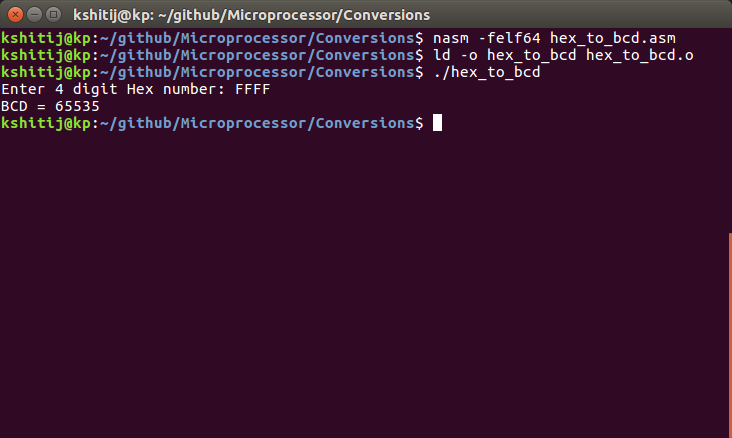
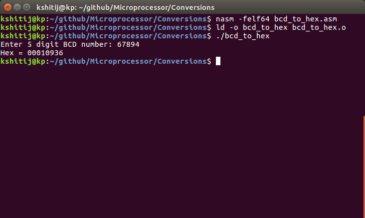

# Conversions
1. Hex to BCD
1. BCD to Hex

#### Hex to BCD conversion
1. Divide Hex number by 0A
1. Push the remainder
1. Increment the count
1. Pop from stack count times
1. Print each digit by converting to ASCII

#### BCD to Hex conversion
1. Start from end of number
1. Initialize factor by 1
1. Multiply last digit by factor
1. store result in rbx
1. multiply factor by 10
1. Repeat from step 3 for no. of digits

