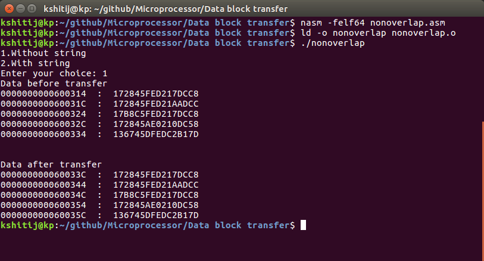
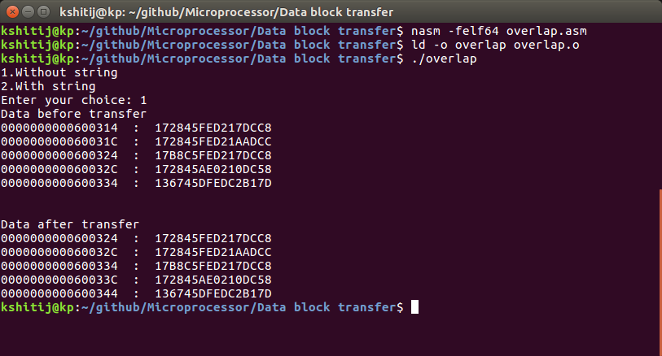

# Data block transfer
### Instructions to execute non-overlapping block transfer
nasm -felf64 nonoverlap.asm
 
ld -o nonoverlap nonoverlap.o
 
./nonoverlap

### Instructions to execute overlapping block transfer
nasm -felf64 overlap.asm
 
ld -o overlap overlap.o
 
./overlap

