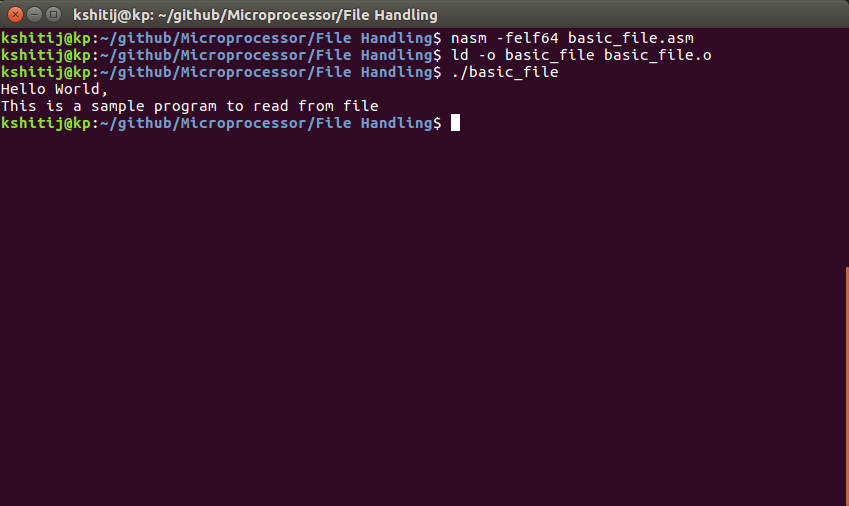
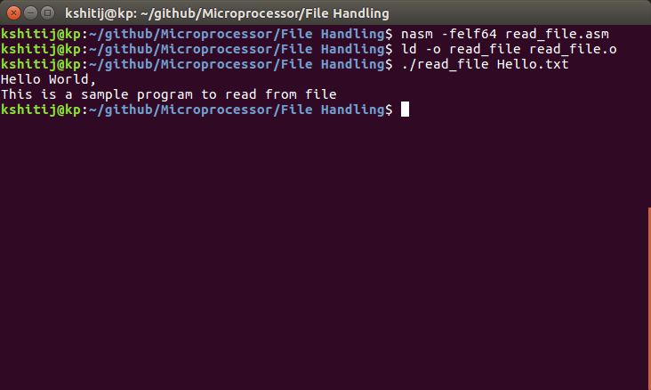

# File Handling in assembly
|basic_file.asm|Opening a file ,reading it's contents and displayint it on console|
|--------------|------------------------------------------------------------------|
|read_file.asm |Same as above, but filename is read from terminal                 |
|--------------|------------------------------------------------------------------|

